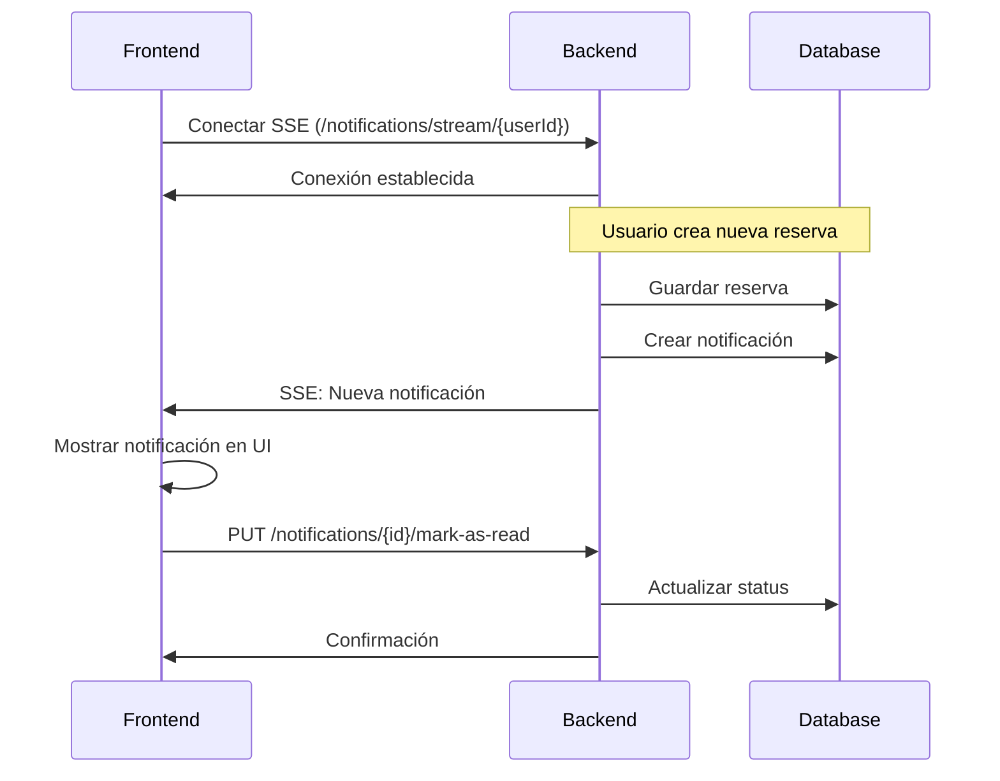

# Sistema de Gestión de Citas e Inventario

Este repositorio contiene el código fuente de un sistema de **Gestión de Citas e Inventario**. Es una aplicación backend desarrollada en **Java** con el framework **Spring Boot**, diseñada para administrar recursos, personal y la programación de citas.

## Tabla de Contenido

- [Tecnologías](#tecnologías)
- [Dependencias Clave](#dependencias-clave)
- [Cómo Empezar](#cómo-empezar)
  - [Prerrequisitos](#prerrequisitos)
  - [Instalación](#instalación)
- [Ejecutar la Aplicación](#ejecutar-la-aplicación)
  - [Configuración](#configuración)
  - [Arranque](#arranque)
- [Estrategia SSE + REST API para Notificaciones](#estrategia-sse--rest-api-para-notificaciones)
  - [Arquitectura de Notificaciones en Tiempo Real](#arquitectura-de-notificaciones-en-tiempo-real)
  - [Guía de Implementación para Frontend](#-guía-de-implementación-para-frontend)
- [Documentación de la API](#documentación-de-la-api)
- [Licencia](#licencia)

## Tecnologías

La aplicación está construida sobre un stack de tecnologías moderno y robusto:

- **Java 21**: Versión del lenguaje de programación.
- **Spring Boot 3.5.0**: Framework principal para el desarrollo de la aplicación.
- **Spring Data JPA**: Para la persistencia de datos y comunicación con la base de datos.
- **Spring Security**: Para la gestión de autenticación y autorización.
- **PostgreSQL**: Sistema de gestión de bases de datos relacional.
- **Maven**: Herramienta para la gestión de dependencias y construcción del proyecto.

## Dependencias Clave

El proyecto utiliza las siguientes librerías para funcionalidades críticas:

| Dependencia                               | Versión | Propósito                                            |
| ----------------------------------------- | ------- | ---------------------------------------------------- |
| `spring-boot-starter-web`                | 3.5.0   | Framework web para APIs REST.                       |
| `spring-boot-starter-data-jpa`           | 3.5.0   | Persistencia de datos con JPA/Hibernate.            |
| `spring-boot-starter-security`           | 3.5.0   | Autenticación y autorización.                       |
| `spring-boot-starter-validation`         | 3.5.0   | Validación de datos de entrada.                     |
| `spring-boot-starter-actuator`           | 3.5.0   | Monitoreo y métricas de la aplicación.              |
| `flyway-core` & `flyway-database-postgresql` | 11.11.2 | Gestión de migraciones de la base de datos.          |
| `java-jwt`                                | 4.4.0   | Creación y validación de JSON Web Tokens (JWT).      |
| `springdoc-openapi-starter-webmvc-ui`     | 2.8.8   | Generación de documentación de la API con Swagger.   |
| `mapstruct`                               | 1.6.3   | Mapeo de objetos (ej. entre Entidades y DTOs).       |
| `lombok`                                  | -       | Reducción de código repetitivo en clases Java.       |
| `spring-dotenv`                           | 3.0.0   | Carga de variables de entorno desde un archivo `.env`. |
| `reactor-core`                            | 3.5.0   | Programación reactiva y soporte para SSE.            |
| `postgresql`                              | -       | Driver de conexión a PostgreSQL.                     |

## Cómo Empezar

Sigue estos pasos para configurar el entorno de desarrollo local.

### Prerrequisitos

- **JDK 21**: Java Development Kit.
- **Maven 3.x**: Gestor de dependencias.
- **PostgreSQL**: Base de datos.

### Instalación

1.  **Clona el repositorio:**
    ```bash
    git clone <URL_DEL_REPOSITORIO>
    cd proyecto-tecno
    ```
2.  **Instala las dependencias:**
    ```bash
    mvn clean install
    ```

## Ejecutar la Aplicación

### Configuración

La aplicación utiliza la dependencia `spring-dotenv` para gestionar la configuración sensible, como las credenciales de la base de datos.

1.  Crea un archivo llamado `.env` en la raíz del proyecto.
2.  Añade las siguientes variables con tus valores locales:

    ```dotenv
    # URL de conexión a tu base de datos PostgreSQL
    DB_URL=jdbc:postgresql://localhost:5432/tu_base_de_datos

    # Usuario y contraseña de la base de datos
    DB_USER=tu_usuario
    DB_PASSWORD=tu_contraseña

    # Configuración de JWT (puedes cambiar estos valores)
    JWT_SECRET_KEY=tu_clave_secreta_muy_larga_y_segura
    JWT_ISSUER=gestion-citas-api
    JWT_EXPIRATION_MS=86400000 # 24 horas
    ```

### Arranque

Una vez configurado el archivo `.env`, puedes iniciar la aplicación con el siguiente comando de Maven:

```bash
mvn spring-boot:run
```

Flyway aplicará automáticamente las migraciones de la base de datos al arrancar.

## Estrategia SSE + REST API para Notificaciones

### Arquitectura de Notificaciones en Tiempo Real

El sistema implementa una **estrategia híbrida** que combina **Server-Sent Events (SSE)** para notificaciones push en tiempo real y **REST API** tradicional para operaciones CRUD y consultas de datos.

#### 📡 Server-Sent Events (SSE)

**¿Qué es SSE?**
Server-Sent Events es una tecnología web que permite al servidor enviar datos al cliente de forma unidireccional en tiempo real, manteniendo una conexión HTTP persistente.

**Implementación en el Backend:**
```java
@GetMapping(value = "/notifications/stream/{userId}", produces = MediaType.TEXT_EVENT_STREAM_VALUE)
public SseEmitter streamNotifications(@PathVariable Long userId) {
    // Retorna un stream de notificaciones para el usuario específico
}
```

**Casos de Uso:**
- ✅ Notificaciones de nuevas reservas
- ✅ Confirmaciones/rechazos de solicitudes
- ✅ Actualizaciones de estado de recursos
- ✅ Alertas del sistema en tiempo real

#### 🔄 REST API para Gestión de Datos

**Endpoints Principales:**
```bash
# Gestión de Notificaciones
GET    /api/notifications/{userId}           # Obtener notificaciones pendientes
POST   /api/notifications                    # Crear nueva notificación  
PUT    /api/notifications/{id}/mark-as-read  # Marcar como leída
DELETE /api/notifications/{id}               # Eliminar notificación

# Gestión de Reservas
GET    /api/reservations                     # Listar reservas
POST   /api/reservations                     # Crear reserva
PUT    /api/reservations/{id}                # Actualizar reserva
DELETE /api/reservations/{id}                # Cancelar reserva
```

### 🚀 Guía de Implementación para Frontend

#### 1. Conexión SSE (JavaScript/TypeScript)

```javascript
// Conectar al stream de notificaciones
const eventSource = new EventSource(`/api/notifications/stream/${userId}`);

// Escuchar notificaciones en tiempo real
eventSource.onmessage = function(event) {
    const notification = JSON.parse(event.data);
    
    // Mostrar notificación en la UI
    showNotification(notification);
    
    // Actualizar contador de notificaciones pendientes
    updateNotificationBadge();
};

// Manejar errores de conexión
eventSource.onerror = function(event) {
    console.error('Error en conexión SSE:', event);
    // Implementar lógica de reconexión
    setTimeout(() => {
        eventSource.close();
        connectSSE(); // Reconectar
    }, 5000);
};
```

#### 2. Integración con REST API

```javascript
// Obtener notificaciones pendientes al cargar la página
async function loadPendingNotifications(userId) {
    try {
        const response = await fetch(`/api/notifications/${userId}`);
        const notifications = await response.json();
        
        // Mostrar notificaciones existentes
        displayNotifications(notifications);
        
    } catch (error) {
        console.error('Error al cargar notificaciones:', error);
    }
}

// Marcar notificación como leída
async function markAsRead(notificationId) {
    try {
        await fetch(`/api/notifications/${notificationId}/mark-as-read`, {
            method: 'PUT',
            headers: {
                'Content-Type': 'application/json',
                'Authorization': `Bearer ${token}`
            }
        });
        
        // Actualizar UI
        updateNotificationStatus(notificationId, 'VIEWED');
        
    } catch (error) {
        console.error('Error al marcar como leída:', error);
    }
}
```

#### 3. Estructura de Datos de Notificación

```typescript
interface Notification {
    id: number;
    senderId: number;
    message: string;
    notificationType: 'NEW_RESERVATION' | 'ACCEPTED' | 'REJECTED';
    status: 'PENDING' | 'VIEWED';
    createdAt: string;
    sentAt?: string;
    userId: number;
    reservationId: number;
}
```

#### 4. Mejores Prácticas para Frontend

**✅ Manejo de Conexiones:**
- Implementar reconexión automática en caso de pérdida de conexión
- Cerrar conexiones SSE al navegar fuera de la página
- Usar un solo stream SSE por usuario activo

**✅ Performance:**
- Limitar el número de notificaciones mostradas simultáneamente
- Implementar paginación para notificaciones históricas
- Usar throttling para evitar spam de notificaciones

**✅ UX/UI:**
- Mostrar indicadores visuales (badges, sonidos) para nuevas notificaciones
- Permitir al usuario configurar preferencias de notificación
- Implementar estado de "cargando" durante operaciones REST

#### 5. Ejemplo de Flujo Completo



### 🔧 Configuración de Desarrollo

Para probar las notificaciones SSE en desarrollo:

1. **Habilitar CORS** para conexiones SSE:
```yaml
# application.yml
spring:
  web:
    cors:
      allowed-origins: "http://localhost:3000"
      allowed-methods: "GET,POST,PUT,DELETE"
      allowed-headers: "*"
```

2. **Variables de entorno**:
```dotenv
# Configuración SSE
SSE_TIMEOUT=30000
SSE_HEARTBEAT_INTERVAL=15000
```

## Documentación de la API

Una vez que la aplicación esté en ejecución, puedes acceder a la documentación interactiva de la API (generada por Swagger) en tu navegador:

[http://localhost:8080/swagger-ui.html](http://localhost:8080/swagger-ui.html)

Desde esta interfaz podrás explorar todos los endpoints, ver los modelos de datos y probar la API directamente.

## Licencia

Este proyecto está bajo la Licencia Apache 2.0.